# denovo_OLC: evidence-aware per-UMI assembly for SE600 linked reads

## Abstract

Barcode-partitioned SE600 libraries contain small pools of single-end reads that
originate predominantly from one physical DNA molecule.  Per-UMI assembly must
therefore work with sparse, heterogeneous pools at million-UMI scale, while
remaining robust to read-end artefacts and independent sequencing errors.  We
developed [denovo_OLC](https://github.com/Complete-Genomics/LFR_Pipeline/tree/main/modules/clfr/denovo), a deterministic, in-process overlap-layout-consensus
(OLC) assembler for this setting.  The assembler combines boundary-k-mer
candidate indexing, conservative verified overlaps, internal-anchor recovery,
and a multi-read pileup rescue that is invoked only after ordinary pairwise
extension fails.  A separate, pre-assembly read-quality stage represents
within-UMI read disagreement as a conflict graph.  The best tested ML
integration uses a learned per-read identity score as an O(n) prefilter before
the bounded O(n^2) graph: on a held-out 3,000-barcode Zymo evaluation set,
removing the eight lowest-scoring reads per capped pool reduced pairwise
comparisons by 54.7% and increased mean contig identity from 95.05% to 95.28%.

The work also establishes important negative results.  Direct pairwise OLC is
less tolerant than a de Bruijn graph to redundant reads carrying independent
errors; globally relaxing the mismatch threshold is not a safe remedy.
Likewise, a standalone ML ranker had strong cross-validation accuracy but was
inferior to the conflict graph as an assembly decision rule.  The resulting
design retains local graph structure as the safety-critical decision mechanism:
ML removes globally poor reads, then the graph resolves the remaining local
conflicts.  On a fixed
20,000-UMI benchmark, correcting raw-component/merge/output semantics increased
the number of >=1 kb contigs from 16,908 to 21,139; 99.3% of lengthened primary
contigs had >=95% one-fold read-back breadth.

## Introduction

Linked-read barcodes provide a natural assembly unit: the reads assigned to one
UMI are a small, local evidence pool rather than a whole metagenome.  This
structure makes per-UMI assembly attractive, but it also exposes failure modes
that are muted in conventional high-depth assembly.  In SE600 data, reads are
long enough to encounter noisy termini and read-through sequence, yet individual
barcode pools can contain only partial tiling evidence.  At 1.5--3 million UMI
scale, launching a general-purpose assembler for every barcode is dominated by
process overhead.

An initial greedy OLC implementation was fast and useful for low-depth pools,
including single-read cases, but its limitation was fundamental: comparing two
reads combines their independent errors.  Genuine bridges can therefore fail a
strict pairwise mismatch test even when the full read pool supports a coherent
path.  A de Bruijn graph aggregates k-mer support across reads and is naturally
more tolerant of this failure mode.  The goal here is not to reproduce a global
de Bruijn graph for every UMI.  Instead, `denovo_OLC` preserves fast,
conservative OLC for ordinary pools and deploys shared, local evidence only in
the stalled cases that need it.

A second challenge is read selection.  A read may be intrinsically low quality,
but whether removing it improves an assembly depends on its disagreement with
the *other reads in the same UMI*.  This distinction motivates a graph-aware ML
design: ML removes a limited number of globally poor reads first, then the
conflict graph resolves the remaining pool-specific disagreements.

## Materials and methods

### Data and evaluation cohorts

The analyses used trimmed SE600 linked-read data grouped by barcode, a
ZymoBIOMICS mock community with known references, and a high-diversity soil
(`hs6`) cohort without a complete truth reference.  The principal controlled
OLC benchmark used the first 20,000 barcodes from the same trimmed input for
all compared runs.  Comparisons were always restricted to the intersection of
barcodes actually present in both outputs; comparing unmatched full datasets is
invalid and was explicitly avoided.

For Zymo, contigs and reads were evaluated against the known reference set using
base-level identity and alignment coverage.  For data without a complete
reference, we used read-back breadth, verified two-end support, and a
reference-free junction signal.  The junction signal counts reads that span an
interior position with locally verified sequence identity on both sides; it is
designed to distinguish real spanning evidence from a superficial k-mer
placement across a putative chimera join.

### Workflow overview

Figure 1 summarizes the full workflow.  Solid paths describe the implemented
SE workflow.  The ML prefilter and Racon branches are optional evaluated paths,
not unconditional production defaults.  In particular, the anomaly gate runs
before assembly: only an SE sample with adverse Zymo-relative depth and
read-length drift *and* a safe projected retained depth is salvaged.  Other
samples, and all PE samples in `auto` mode, retain their original read pools.

```mermaid
flowchart LR
    A[Input FASTQ with read qualities] --> B[Adapter trimming and barcode grouping]
    B --> C[Barcode-grouped read TSV]
    C --> D{Sample anomaly gate\nZymo-relative depth and length drift\nplus retained-depth safety}
    D -->|normal, report-only, or PE| E[Original per-UMI read pools]
    D -->|SE salvage| F[Remove reads under 300 bp\nkeep first 300 eligible reads per UMI]
    F --> E

    E --> G{Optional ML prefilter\ntrained model available}
    G -->|off or graph-only production path| H[Conflict-graph read-quality filtering]
    G -->|scheme B, evaluated| I[Score reads and remove K lowest-scoring\nreads from capped candidate pool]
    I --> H
    H --> J[Per-UMI OLC\nboundary k-mer, verified overlaps,\ninternal anchors, collective rescue]
    J --> K[Draft contigs]

    K --> L{Optional Racon polishing\npilot / validation path}
    E -. read pool, up to 50 reads in pilot .-> L
    L -->|off| M[Contigs and read-back / junction QC]
    L -->|on| N[minimap2 read-to-contig alignment\nRacon partial-order consensus]
    N --> M

    classDef production fill:#e8f5e9,stroke:#2e7d32,color:#1b5e20;
    classDef optional fill:#fff8e1,stroke:#ef6c00,color:#e65100;
    class D,E,F,H,J,K,M production;
    class G,I,L,N optional;
```

### OLC assembly

For one barcode, unique reads are sorted deterministically by decreasing length
and sequence, then assembled through repeated greedy components.  Candidate
extension is evaluated in both orientations.  An overlap is accepted only after
a shared boundary k-mer prefilter and a full suffix-prefix comparison satisfy
the configured minimum overlap and mismatch-rate limit.  Thus a k-mer is a
candidate-discovery device, not the final correctness criterion.

The implementation uses the following ordered evidence ladder:

1. Boundary suffix-prefix extension using a per-UMI boundary-k-mer inverted
   index.
2. Bidirectional internal-anchor extension for reads with noisy literal ends;
   the anchor must be followed by a verified overlap.
3. Collective rescue after the first two paths stall.  Reads are placed by
   multiple co-linear exact 17-mers; repetitive anchors are excluded.  Only
   bases outside the draft contig with support from at least two independent
   reads are appended.
4. Post-assembly majority-vote polishing, which changes a base only with quorum
   and concordance support.

All raw components are retained until post-assembly deduplication and merging.
The user-visible `max_contigs` limit is applied only when final contigs are
written.  This separation is essential: limiting raw attempts before merging
silently prevents later components from contributing an otherwise valid bridge.

The collective step may use reads consumed by earlier raw-component attempts as
evidence, but an accepted extension must consume at least one currently unused
read.  This progress invariant prevents repeated evidence-only extension in
repetitive input.

### Candidate indexing and computational complexity

Naive greedy OLC repeatedly scans every remaining read, giving a practical
floor near O(attempts x pool size) on poor pools.  `denovo_OLC` builds a
boundary-k-mer index once per UMI and queries only reads that can satisfy the
existing mandatory k-mer prefilter.  The subsequent overlap validation and
candidate order remain unchanged.  On a documented pathological barcode, this
reduced assembly time from 100.2 s to 5.07 s (11.7x) with byte-identical output
relative to the unindexed implementation; the optimization changes search cost,
not acceptance semantics.

### k-mer policy

Short k-mers increase sensitivity to weak or short overlap evidence, but also
increase the number of coincidental candidates.  Longer k-mers reduce candidate
traffic and are therefore faster and more specific at the discovery stage, but
can miss a true overlap before it reaches the final verification step.  The
current production OLC boundary prefilter uses k=10; collective rescue uses a
strict 17-mer anchor.  An experimental `k=17 -> k=10` adaptive mode first runs
the strict path and retries the complete UMI with k=10 only if the strict path
produces no valid contig.  It does not combine contig pools or choose a result
merely because it is longer.

In 2,000-barcode tests, Zymo mean identity was 94.13%, 94.15%, and 94.15% for
k=10, k=17, and adaptive k=17->10, respectively; soil junction-suspect rates
were 33.45% and 33.30% for k=10 and k=17.  These differences are within the
observed noise range.  k=17 was approximately 6% faster on the 2,000-UMI test,
but a production-default change requires a larger evaluation that covers the
full depth distribution.

### Graph-aware ML read-quality filtering

Before assembly, reads with an ungapped overlap identity below 0.90 are linked
by a conflict edge within their barcode.  The baseline filter greedily removes
the highest-degree vertices until no conflict edges remain.  This operation is
best interpreted as a read-quality filter: it preferentially removes
indel/error-rich reads, not proven contaminants or foreign molecules.

For ML experiments, a LightGBM regressor was trained on Zymo read identity to
known references.  Features included quality summaries, read length,
homopolymer statistics, minimizer spacing, pool depth, and the fraction of
within-UMI k-mers supported by other reads.  Splits were grouped by barcode to
avoid pool-level feature leakage.  The model achieved five-fold MAE 2.10 versus
8.48 for a global-mean baseline, but this was not sufficient to justify a
standalone deployment.

Three integrations were evaluated:

* **Rejected: global ML ranking.** Removing the globally lowest-scoring reads
  at the same 13.6% removal rate gave mean contig identity 94.30%, versus
  95.05% for the graph-only filter.  Accurate single-read identity prediction
  is not the same decision as selecting the read that harms a particular UMI.
* **Useful but secondary: ML in the graph.** The graph structure and primary degree rule
  are preserved.  Only equal-degree vertices are ordered by predicted identity,
  removing the lower-scoring read first.  On 3,000 held-out barcodes, the method
  retained the 13.58% removal rate and increased mean identity to 95.22%.
* **Preferred: ML prefilter followed by the conflict graph (scheme B).** Before
  graph construction, ML removes the eight lowest-scoring reads from each
  candidate pool (capped at 25 reads); the unchanged graph then makes the final
  conflict-aware decisions.  This reduced pairwise comparisons by 54.7% and
  yielded 95.28% mean identity, exceeding both graph-only filtering (95.05%)
  and ML tie-breaking (95.22%) in the same evaluation.  The division of labor is
  complementary: ML removes globally poor reads, while the graph identifies
  reads whose removal resolves a specific within-UMI conflict.

Scheme B is the preferred evaluated operating point, but not yet an
unconditional production default: it removes 24.48% of candidate reads versus
13.59% for the graph-only baseline and has not been replicated across additional
sample types.

### Racon polishing and factorial ablation

For the polishing pilot, up to 50 reads from the original per-UMI pool were
aligned back to each draft contig with `minimap2 -x sr` and passed to Racon for
partial-order consensus.  A contig with no usable read-to-contig alignment was
passed through unchanged.  The experiment used a 2 x 2 factorial design:
plain or ML tie-break draft, with or without Racon.  Thus the combined
Racon(ML-draft)-versus-plain comparison is an end-to-end arm, while the four
arms together constitute the ablation that separates each contribution and
their interaction.  This pilot evaluates the ML tie-break draft, not scheme B.

## Results

### Correct component semantics recover read-supported sequence

On the fixed 20,000-UMI benchmark, moving the contig cap to final output and
allowing all raw components to reach post-assembly merging increased total
contigs from 69,596 to 124,240 and >=1 kb contigs from 16,908 to 21,139.
There were 2,349 barcodes with a longer primary contig.  Of these lengthened
contigs, 2,333 (99.3%) had >=95% one-fold read-back breadth and 2,312 (98.4%)
had >=80% two-fold breadth.  These results support the semantic correction, but
they do not prove every long extension correct; one-end-supported and breadth
regression cohorts remain explicit review targets.

### Collective rescue improves but does not erase the OLC--graph gap

Against a matched set of 5,720 barcodes with >=1 kb MEGAHIT output, the fraction
of OLC primary contigs at least as long as the MEGAHIT contig increased from
23.0% to 68.2% after collective rescue.  This is a structural comparison, not a
truth claim: both OLC-longer and MEGAHIT-longer cases require raw-read evidence.
Representative failures showed that MEGAHIT paths could have continuous,
full-length raw-read coverage while pairwise OLC remained near read length.
Collective pileup rescued part of this gap without globally relaxing mismatch
thresholds, but it does not make greedy OLC equivalent to a de Bruijn graph.

### ML prefilter plus conflict graph gives the best measured quality--speed trade-off

The graph-only quality filter increased mean Zymo contig identity from 94.16%
without filtering to 95.05%.  A stand-alone ML filter was substantially worse at
the same removal rate, despite strong cross-validation on the surrogate label.
The best tested strategy was scheme B: remove the eight lowest-scoring reads per
capped pool using ML, then apply the unchanged conflict graph.  It reduced
pairwise comparisons by 54.7% and increased mean identity to 95.28%, at a
24.48% read-removal rate.  In 2,997 paired barcodes, scheme B was better than
the graph-only filter for 805 (26.9%), worse for 516 (17.2%), and tied for
1,676 (55.9%).

ML tie-breaking inside the graph was also positive (95.22% at 13.58% removal),
but scheme B was preferable in this evaluation because it achieved a slightly
higher identity while removing more than half of pairwise graph work.  The
result supports a specific claim: ML can improve read filtering when it
augments a molecular-evidence graph, not when it replaces local structure with
independent global scores.

### Factorial ablation shows that ML and Racon gains are largely additive

The Racon(ML-draft)-versus-plain result is an end-to-end comparison, but not by
itself an ablation: it changes both draft selection and polishing.  The
complete 2 x 2 Zymo experiment resolves that ambiguity on 4,998 matched
barcodes with known-reference scoring:

| Draft selection | Polishing | Mean identity | Difference from plain raw |
|---|---|---:|---:|
| plain | none | 94.9698 | -- |
| ML tie-break | none | 95.1632 | +0.1934 |
| plain | Racon | 96.7406 | +1.7708 |
| ML tie-break | Racon | 96.9022 | **+1.9324** |

Racon(ML draft) remained 0.1616 identity points above Racon(plain draft)
(Wilcoxon p = 6.87e-13).  Therefore approximately 84% of the raw ML gain
remained after polishing; only 0.0318 points were overlapping benefit.  The
result supports complementary mechanisms: ML changes which reads form the
draft, whereas Racon corrects bases through read-to-contig realignment and
partial-order consensus.

The same combined arm was tested on 2,970 matched hs8 barcodes using a
fixed-reference local-truth evaluation.  Racon(ML draft) improved mean identity
by 1.7675 points over plain raw, but its 1.01% severe-loss rate was effectively
at the pre-specified 1% safety boundary.  Racon is therefore a promising
post-assembly stage, not yet a production default; larger field-sample
validation is required before enabling the combined path.

## Discussion

`denovo_OLC` is intentionally a hybrid evidence system.  Ordinary barcode pools
take a fast, deterministic OLC path.  Difficult pools gain conservative
internal-anchor and multi-read rescue rather than a globally relaxed mismatch
threshold.  This preserves speed and limits the opportunity for unsupported
joins, but it also leaves a known limitation: local evidence aggregation is not
a full de Bruijn graph and cannot recover every error-obscured path.

The ML results illustrate an analogous design principle.  A model can predict
read identity accurately and still make a poor assembly decision if it ignores
the local conflict structure.  The best tested division of labor is scheme B:
ML first removes a small, fixed set of globally poor reads, after which the graph
retains authority over local conflict resolution.  This improves both measured
identity and pairwise cost, but its higher read-removal rate and limited
cross-sample validation warrant caution.

Several plausible interventions were tested and rejected: whole-UMI removal,
global mismatch relaxation, single-minimizer deduplication, homopolymer
compression, and standalone ML ranking.  These negative findings are part of
the method, not omissions.  They constrain future development toward
evidence-preserving local graph/bridge rescue, better indel-aware validation,
and external validation across library types.

## Limitations

* Zymo is the only complete reference-truth cohort; soil supports
  reference-free validation but not direct base-level accuracy measurement.
* Read-back coverage alone cannot validate every join.  Junction-spanning
  evidence is more discriminative, but it is a risk signal rather than a proof
  of absence of chimera.
* The reported ML experiments require quality-bearing input and a trained model;
  the model artefact and its integrations are not represented by this minimal
  standalone repository.
* Results for k=17 and adaptive fallback do not yet meet the pre-specified
  20,000-UMI, full-depth-distribution threshold for changing the production
  default.

## Code and data availability

The maintained implementation and workflow are in the
[LFR pipeline denovo module](https://github.com/Complete-Genomics/LFR_Pipeline/tree/main/modules/clfr/denovo).
This repository is a release-oriented description of the method.  Benchmark
details, failed hypotheses, and decision records will be documented in
[`tech_notes.md`](tech_notes.md).
